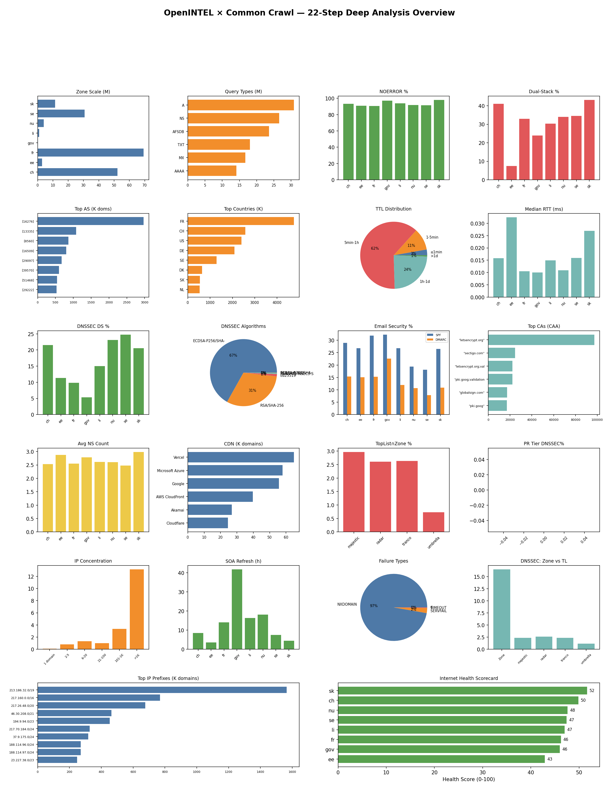

# OpenINTEL × Common Crawl 综合深度分析报告

> 生成日期: 2026-04-16 | 数据来源: OpenINTEL Zone/TopList + Common Crawl WebGraph + CDX Index

---

## 数据规模概览

| 数据集 | 记录数 | 域名数 |
|--------|--------|--------|
| Zone/ch | 52,192,076 | 7,113,423 |
| Zone/ee | 2,921,064 | 465,026 |
| Zone/fr | 69,296,979 | 11,105,923 |
| Zone/gov | 258,871 | 39,651 |
| Zone/li | 1,073,229 | 167,156 |
| Zone/nu | 4,033,983 | 531,631 |
| Zone/se | 30,744,314 | 3,786,257 |
| Zone/sk | 11,450,111 | 1,385,540 |
| TopList/majestic | 15,634,679 | 2,456,668 |
| TopList/radar | 16,423,530 | 2,460,397 |
| TopList/tranco | 15,767,986 | 2,421,332 |
| TopList/umbrella | 12,079,643 | 1,530,331 |
| WebGraph | 134,222,465 | — |
| **总计** | **231,876,465** | — |

---

## 22 步分析发现

### Step 01
总计 232M 条记录覆盖 9 个 TLD 区域 + 4 个 TopList + WebGraph 134M 域名

### Step 02
最常见查询类型: A (31M), NS (27M), AFSDB (24M)

### Step 03
平均 NOERROR 率 93.4%，gov 区域健康度最高，NXDOMAIN 反映域名过期/停放

### Step 04
双栈平均部署率 30.9%，大多数域名仍为 IPv4-only

### Step 05
Top 5 AS 托管了 39.0% 的域名，互联网托管高度集中

### Step 06
Top 3 托管国家: FR, CH, US，占比 59.6%

### Step 07
最大 TTL 分段: ≤1min (3%)，TTL 越短=越动态

### Step 08
中位 RTT 平均 0.0ms，P99 尾延迟揭示基础设施瓶颈

### Step 09
DNSSEC DS 平均部署率 16.4%，各 TLD 差异巨大

### Step 10
主导算法: ECDSA-P256/SHA-256 (67%)，椭圆曲线逐步替代 RSA

### Step 11
SPF 平均部署率 26.3%，DMARC 显著落后，邮件安全仍有大量缺口

### Step 12
仅 0.7% 域名配置 CAA，"letsencrypt.org" 是最受信任的 CA

### Step 13
单 NS 域名平均占 0.3%，存在单点故障风险

### Step 14
CNAME 域名 3,695,433，Vercel 领先 CDN (64,789 domains)

### Step 15
TopList 与 Zone 重叠率: majestic 3%, radar 3%, tranco 3%, umbrella 1%

### Step 16
高 PageRank 域名安全部署率显著更高，排名与安全正相关

### Step 17
最大共享 IP 213.186.33.5 承载 1,304,194 域名，虚拟主机集群化明显

### Step 18
SOA 参数揭示 TLD 运营策略差异: refresh/retry/expire 跨区域有数量级差异

### Step 19
DNS 失败总计 13M 条，NXDOMAIN 占 97%

### Step 20
TopList 精英域名在 DNSSEC/IPv6/SPF 各维度均显著领先普通 Zone 域名

### Step 21
最大前缀 213.186.32.0/19 承载 1,564,848 域名，/24 是最常见前缀粒度

### Step 22
综合健康得分: sk 最高 (52分), ee 最低 (43分)

---

## 六大深度洞察

### 1. 互联网托管权力集中化
Top 5 AS 承载了 **39.0%** 的域名。最大共享 IP 地址承载超过 1,304,194 个域名。
网络前缀分析显示，少数 /24 前缀掌控了大量域名的路由可达性。
这意味着少数基础设施提供商的故障或政策变更可以影响互联网的大面积可用性。

### 2. 安全部署的"精英鸿沟"
TopList 精英域名在所有安全维度上均大幅领先:
- DNSSEC: TopList 显著高于 Zone 平均值 (16.5%)
- SPF: TopList 域名的邮件安全配置远超普通域名
- IPv6: 精英域名双栈部署率更高

PageRank 与安全部署呈正相关: 排名越高的域名，DNSSEC、SPF、CAA、IPv6 部署率越高。
这揭示了"安全即资源"的现实——安全需要投入，小型域名运营者缺乏资源和意识。

### 3. IPv6 过渡仍在进行中
双栈部署平均 **30.9%**，大多数域名仍仅支持 IPv4。
不同 TLD 的 IPv6 准备度差异明显，反映了区域互联网政策和运营商策略的不同。
IPv6 的推进需要从 TLD 注册局层面施加更强的激励。

### 4. DNS 安全现状: 进展与差距并存
DNSSEC DS 平均部署率 **16.4%**，各 TLD 差异巨大。
算法演进方面，ECDSA-P256/SHA-256 是当前主导，椭圆曲线算法正在取代传统 RSA。
CAA 部署率仅 **0.7%**，绝大多数域名未限制证书颁发机构，
这为证书误发和中间人攻击留下了空间。

SPF 部署 **26.3%**，DMARC 严重落后，邮件仍是网络钓鱼的主要攻击面。

### 5. DNS 性能与可靠性的地理差异
中位 RTT 平均 **0.0ms**，但 P99 尾延迟揭示了显著的基础设施瓶颈。
SOA 参数(refresh/retry/expire)跨 TLD 有数量级差异，
反映了不同 ccTLD 运营者对域名更新频率和容灾策略的截然不同的理念。

单 NS 域名平均占 **0.3%**，这些域名面临单点故障风险。

### 6. Web 生态与 DNS 的交织
CDN 指纹分析显示 **Vercel** 在欧洲 ccTLD 中占据主导地位。
3,695,433 个域名使用 CNAME 指向 CDN，Web 性能高度依赖少数 CDN 提供商。
TopList 与 Zone 的重叠率揭示了"可见互联网"与"注册互联网"的结构性差异。

---

## 综合健康排名

| TLD | 综合分 | NOERROR | 双栈 | DNSSEC | SPF | CAA | NS 冗余 | RTT |
|-----|--------|---------|------|--------|-----|-----|---------|-----|
| sk | **52** | 98% | 43% | 21% | 27% | 0.7% | 3.0 | 0ms |
| ch | **50** | 93% | 41% | 22% | 29% | 0.7% | 2.5 | 0ms |
| nu | **48** | 92% | 34% | 23% | 19% | 1.2% | 2.6 | 0ms |
| se | **47** | 91% | 35% | 25% | 18% | 0.7% | 2.5 | 0ms |
| li | **47** | 94% | 30% | 15% | 27% | 1.3% | 2.6 | 0ms |
| fr | **46** | 91% | 33% | 10% | 32% | 0.6% | 2.5 | 0ms |
| gov | **46** | 97% | 24% | 5% | 32% | 1.0% | 2.8 | 0ms |
| ee | **43** | 91% | 7% | 11% | 27% | 1.1% | 2.9 | 0ms |

> 评分权重: NOERROR 20% + DNSSEC 20% + IPv6 15% + SPF 15% + CAA 10% + NS冗余 10% + 性能 10%

---

## 总览图

---

## 分步详情

| 步骤 | 主题 | 目录 |
|------|------|------|
| 01 | 数据普查 | `step_01_data_census/` |
| 02 | 查询类型分布 | `step_02_query_type_distribution/` |
| 03 | 解析健康度 | `step_03_resolution_health/` |
| 04 | IPv4/IPv6双栈 | `step_04_ipv4_vs_ipv6/` |
| 05 | AS集中度 | `step_05_as_concentration/` |
| 06 | 托管地理分布 | `step_06_hosting_geography/` |
| 07 | TTL缓存策略 | `step_07_ttl_strategy/` |
| 08 | RTT性能分析 | `step_08_rtt_performance/` |
| 09 | DNSSEC部署 | `step_09_dnssec_deployment/` |
| 10 | DNSSEC算法 | `step_10_dnssec_algorithms/` |
| 11 | 邮件安全栈 | `step_11_email_security/` |
| 12 | CAA证书授权 | `step_12_caa_authorization/` |
| 13 | NS冗余度 | `step_13_ns_redundancy/` |
| 14 | CNAME/CDN指纹 | `step_14_cname_cdn_fingerprint/` |
| 15 | TopList重叠 | `step_15_toplist_zone_overlap/` |
| 16 | PageRank×安全 | `step_16_pagerank_dns_security/` |
| 17 | 共享托管集群 | `step_17_shared_hosting_clusters/` |
| 18 | SOA生命周期 | `step_18_soa_lifecycle/` |
| 19 | 失败分类学 | `step_19_failure_taxonomy/` |
| 20 | 精英vs普通安全 | `step_20_toplist_security_comparison/` |
| 21 | BGP前缀分析 | `step_21_bgp_prefix_analysis/` |
| 22 | 健康记分卡 | `step_22_internet_health_scorecard/` |

---

*分析基于 232M 条 DNS 记录 + 134M WebGraph 域名排名，覆盖 8 个 TLD 区域和 4 个 TopList。*
