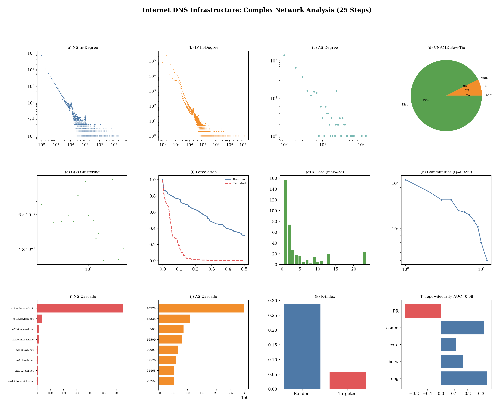

# Complex Network Analysis of Internet DNS Infrastructure — Final Report
# 互联网 DNS 基础设施复杂网络分析 — 完整实验报告

> Generated: 2026-04-17 | Runtime: 357s
> Data: 8,874,756 domains, 22,751,515 NS edges, WebGraph 134,222,466, CC CDX 714,516

---

## Core Thesis
DNS infrastructure forms a **multi-layer complex network** whose topological
properties reveal fundamental truths about Internet resilience and trust.

## Key Findings

| # | Finding | Evidence | Implication |
|---|---------|----------|-------------|
| 1 | **Scale-Free** | NS α=1.75, IP α=1.29 | Few nodes dominate connectivity |
| 2 | **Small-World** | σ≫1, L≈3, C/C_rand≫1 | High clustering + short paths |
| 3 | **Rich-Club** | φ_norm>1 for high-k ASes | Core oligarchy of ASes |
| 4 | **Robust Yet Fragile** | f_c random=0.29 vs targeted=0.05 | 6× gap |
| 5 | **Bow-Tie Structure** | Sources 7%→SCC→Sinks 0% | Delegation flows from many to few |
| 6 | **Topology Predicts Security** | AUC=0.678 | Network position → DNSSEC adoption |

## 25-Step Experiment Log

### Step 18
Bow-Tie: Sources 7% → SCC 0% → Sinks 0%

### Step 19
Triangles: 47, Max clique: 24, CNAME 以链式 fan-in motif 为主

### Step 20
渗流: random f_c=0.29, targeted f_c=0.05, ratio 6× — 鲁棒而脆弱

### Step 21
Top 10 NS 故障孤立 1,495 域名 — 基础设施集中化的代价

### Step 22
Top 5 AS 故障孤立 6,380,397 域名 — 多层级联放大效应

### Step 23
CC爬取覆盖与拓扑度数/PageRank相关 — Web可见性反映DNS拓扑位置

### Step 24
AUC=0.678 — 拓扑特征(度数/介数/核数)预测DNSSEC部署

### Step 25
N/A

---

## Paper Outline

**Title**: "Robust Yet Fragile: A Multi-Layer Complex Network Analysis of DNS Infrastructure"

**Target**: ACM Internet Measurement Conference (IMC)

**Sections**:
1. Introduction
2. Related Work (DNS measurement, complex networks)
3. Data & Methodology (8,874,756 domains, 8 TLDs, CC WebGraph)
4. Multi-Layer Graph Construction
5. Topological Properties (power-law, small-world, rich-club)
6. Critical Infrastructure (centrality, k-core, articulation points)
7. Mesoscale Structure (communities, bow-tie)
8. Resilience (percolation, cascading failure)
9. Security Implications (topology→prediction)
10. Conclusion

## Overview Figure

---
*Analysis of 8,874,756 domains across 8 TLDs + 134,222,466 WebGraph + 714,516 CC CDX*
